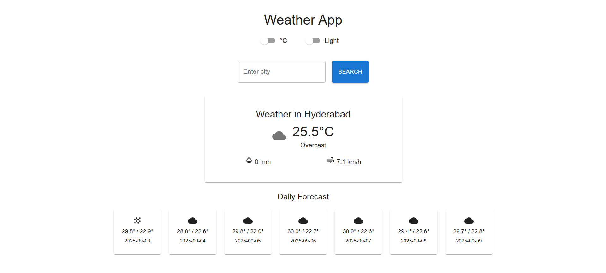
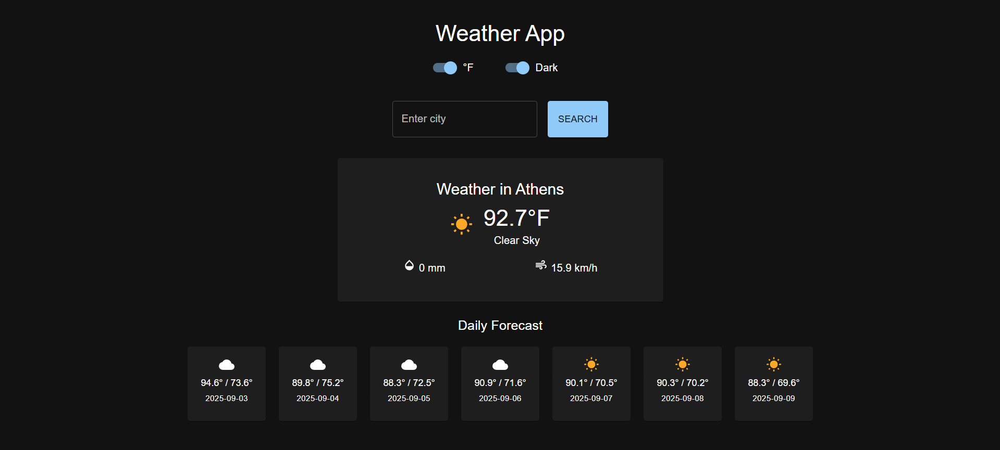

# 🌤 Weather Now App

A modern **Weather Application** built with **React (Vite)** and **Material UI** that allows users to:

✅ Search weather by **city name**  
✅ View **current weather** (temperature, precipitation, wind speed, conditions)  
✅ See **7-day forecast**  
✅ Toggle between **°C and °F**  
✅ Switch **Dark / Light mode**  

---

## 🚀 Live Demo
[**View Deployed App Here**](https://codesandbox.io/p/devbox/fg3gjl) <!-- Add your Vercel/Netlify link after deployment -->

---

## 📸 Screenshots

### **Light Mode**
 

### **Dark Mode**


### **C° - F° Functionality**
 
---

## 🛠 Tech Stack
- **Frontend:** React + Vite
- **UI Library:** Material UI
- **API:** [Open-Meteo API](https://open-meteo.com/)
- **Styling:** MUI + Custom CSS
- **Deployment:** CodeSandBox

---

## ✨ Features
- **Current Weather:**  
  - Temperature, precipitation, wind speed, weather condition icon
- **7-Day Forecast:**  
  - Min & max temperature with weather icons
- **Unit Toggle:**  
  - Switch between Celsius (°C) and Fahrenheit (°F)
- **Dark / Light Mode Toggle**
- **Responsive Design:** Works on desktop and mobile
- **Error Handling:** Graceful error messages for invalid city names or network issues

---

## 🔗 API Endpoints Used
1. **Geocoding API** (for city → coordinates):
```
https://geocoding-api.open-meteo.com/v1/search?name={city}&count=1

```


2. **Weather API** (current + daily forecast):
```
https://api.open-meteo.com/v1/forecast?latitude={lat}&longitude={lon}&daily=temperature_2m_min,temperature_2m_max,weather_code&current=temperature_2m,is_day,precipitation,weather_code,wind_speed_10m,cloud_cover&timezone=auto

```

---

## 📂 Project Structure
```
src/
├── components/
│ ├── SearchBar.jsx
│ ├── WeatherCard.jsx
│ ├── ForecastCard.jsx
│ ├── ForecastList.jsx
│ ├── Loader.jsx
│ └── ErrorAlert.jsx
├── services/
│ └── weatherApi.js
├── utils/
│ └── weatherCodes.js
├── App.jsx
├── main.jsx

```

---

## ⚡ Getting Started

### **1. Clone the repository**
```bash
git clone https://github.com/your-username/weather-now.git
cd weather-now

```
2. Install dependencies

```bash
npm install
```
3. Run the development server
```bash
npm run dev
```
4. Build for production
```bash
npm run build
```

🤝 AI Collaboration
This project was built with assistance from ChatGPT to:

Plan the app architecture

Design UI wireframes

Implement features like °C/°F toggle and Dark Mode

Handle API integration and error states

📌 View Full ChatGPT Conversation  [Here](https://chatgpt.com/share/68b85c40-294c-8000-9ec1-5578156c626d)

📜 License
This project is licensed under the MIT License.
